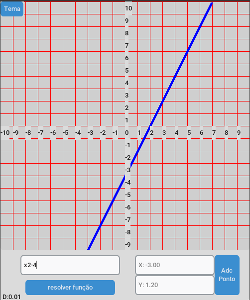

## PlanoCartesiano

🚧 Em construção...  🚧

Plano para incrementação de coordenadas e representação visual de funções de primeiro grau(versão de teste)

 - #### Como Instalar:
 
      [Python3](https://www.python.org/downloads/)

      pip install customtkinter

- #### Funcionalidades:

 - [x] incrementação de coordenadas x e y
 - [ ] Resolução de função (100% funcional)
 - [x] Tema Escuro
 - [x] Representação Visual da Função
 
 ##

